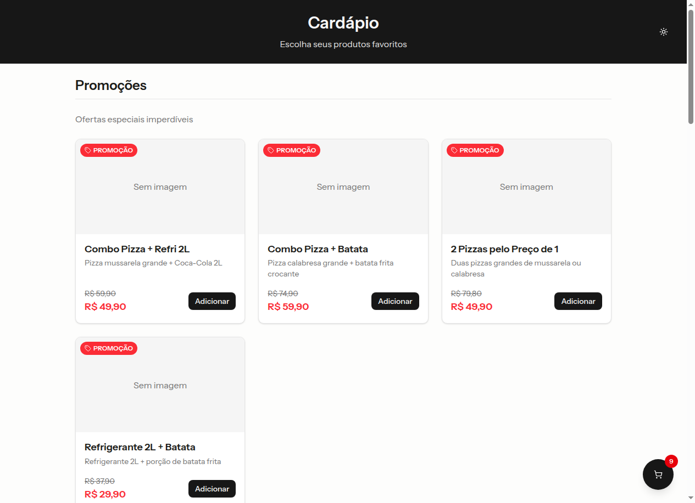
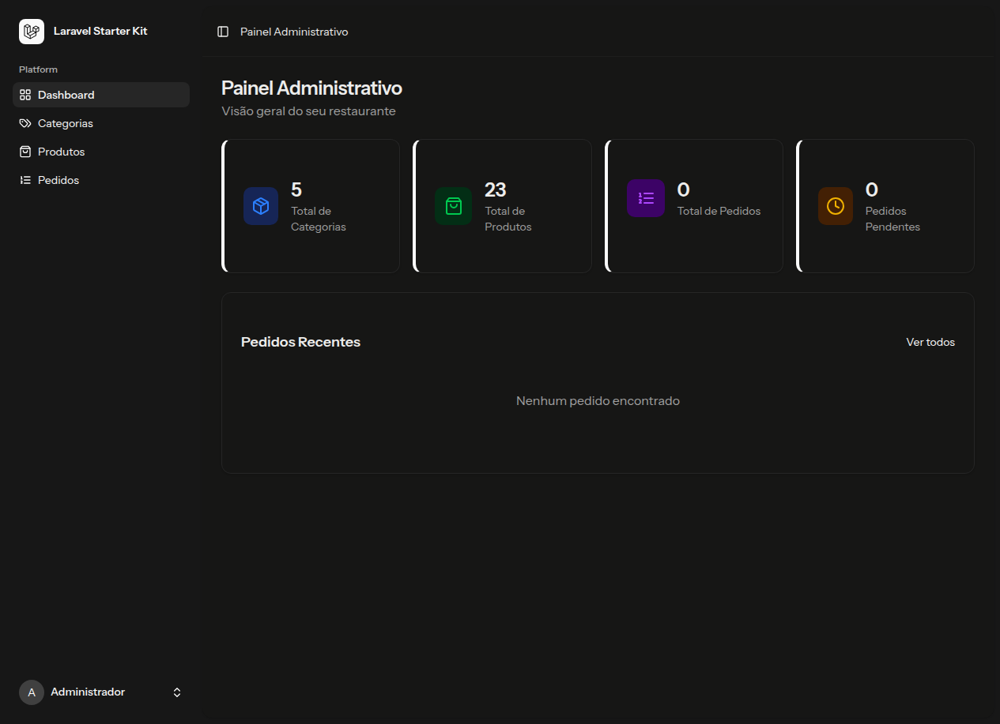
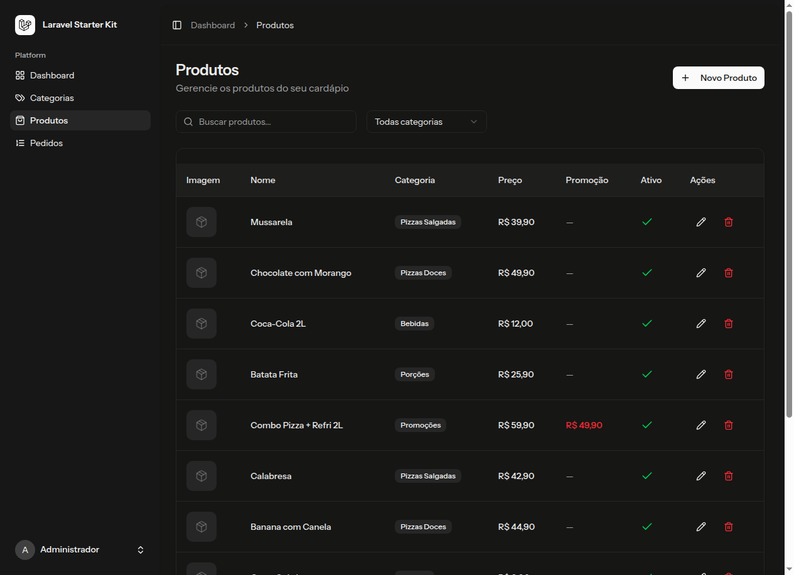
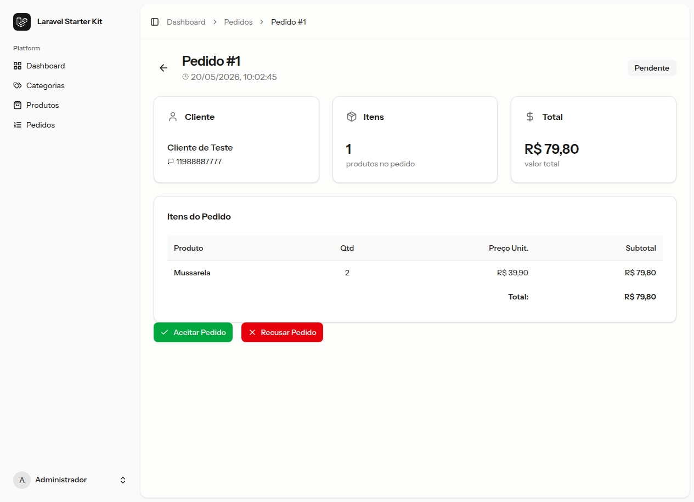

# 🍕 Cardápio Digital Whitelabel

Um sistema moderno de cardápio online e gestão de pedidos via WhatsApp, desenvolvido com uma arquitetura escalável e design focado em conversão. Este projeto foi concebido como um **Whitelabel**, permitindo que seja facilmente adaptado para qualquer restaurante, pizzaria ou lanchonete.

## 🚀 Visão Geral

O sistema oferece uma experiência fluida para o cliente final (Mobile-First) e um painel administrativo robusto para o lojista gerenciar seu negócio em tempo real.

### 🌟 Principais Funcionalidades

#### 📱 Para o Cliente (Frontend)
- **Cardápio Digital**: Navegação intuitiva por categorias de produtos.
- **Experiência Mobile-First**: Interface otimizada para smartphones, simulando a experiência de um app nativo.
- **Carrinho Inteligente**: Adição rápida de itens, ajuste de quantidades e persistência de dados.
- **Checkout via WhatsApp**: Geração automática de mensagem estruturada com todos os itens, quantidades e total, enviada diretamente para o WhatsApp do restaurante.
- **Suporte a Promoções**: Destaque visual para produtos em oferta.

#### 🛠️ Para o Administrador (Painel Admin)
- **Gestão de Categorias**: CRUD completo de categorias com controle de ordem de exibição e status de ativação.
- **Gestão de Produtos**: Controle total de produtos, incluindo upload de imagens, preços, preços promocionais e descrições.
- **Gestão de Pedidos**: Visualização de todos os pedidos recebidos, com a possibilidade de aceitar ou recusar, mantendo o histórico de vendas.
- **Dashboard de Métricas**: Visão geral rápida do volume de categorias, produtos e pedidos.

---

## 📸 Screenshots

| Cardápio Público | Painel Administrativo | Carrinho de Compras |
| :---: | :---: | :---: |
|  |  |  |

| Gestão de Produtos | Detalhes do Pedido | Fluxo de Checkout |
| :---: | :---: | :---: |
|  |  |  |

---

## 🛠️ Tecnologias Utilizadas

O projeto utiliza o que há de mais moderno no ecossistema PHP e JavaScript:

- **Backend**: [Laravel 13](https://laravel.com) (Framework PHP)
- **Frontend**: [React](https://react.dev) com [Inertia.js](https://inertiajs.com) (Single Page App experience)
- **Estilização**: [Tailwind CSS](https://tailwindcss.com) + [Shadcn UI](https://ui.shadcn.com)
- **Estado**: [Zustand](https://zustand-demo.pmnd.rs/) (Gerenciamento de estado leve e rápido)
- **Banco de Dados**: SQLite (Simplicidade e portabilidade)
- **Ícones**: [Lucide React](https://lucide.dev)

---

## ⚙️ Instalação e Configuração

### Pré-requisitos
- PHP 8.2+
- Composer
- Node.js & NPM

### Passo a Passo
1. **Clonar o repositório**
   ```bash
   git clone <url-do-repositorio>
   cd laravel-cardapio
   ```

2. **Instalar dependências do PHP**
   ```bash
   composer install
   ```

3. **Configurar ambiente**
   ```bash
   cp .env.example .env
   php artisan key:generate
   ```

4. **Configurar Banco de Dados**
   - O projeto utiliza SQLite por padrão. Certifique-se de que o arquivo `database/database.sqlite` existe ou execute:
   ```bash
   touch database/database.sqlite
   ```

5. **Executar Migrações e Seeders**
   ```bash
   php artisan migrate --seed
   ```

6. **Instalar dependências do Frontend**
   ```bash
   npm install
   npm run dev
   ```

7. **Link de Storage**
   ```bash
   php artisan storage:link
   ```

---

## 🎯 Customização (Whitelabel)

Para adaptar este sistema para um novo cliente, basta:
1. Alterar as cores primárias no arquivo `tailwind.config.js`.
2. Atualizar a logo no componente `AppLogo.tsx`.
3. Configurar o número do WhatsApp do administrador no arquivo `.env` (`ADMIN_WHATSAPP`).

---

## 📄 Licença
Este projeto é distribuído sob a licença MIT.
